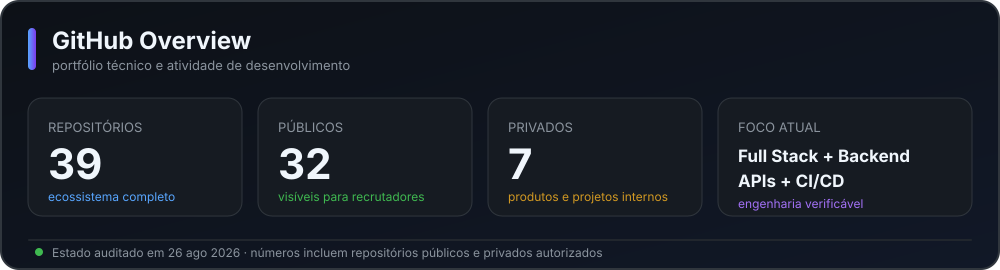
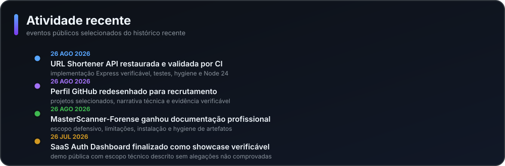

<div align="center">


# Douglas Silva

**Desenvolvedor Full Stack em formação · Ciência da Computação · São Paulo, Brasil**

Construo aplicações web, APIs e automações com foco em **código verificável, testes, segurança, documentação e entrega real**.

<a href="https://douglasdev.tech"></a>
<a href="https://www.linkedin.com/in/douglassilva11"></a>
<a href="mailto:douglasaparecidodasilva@gmail.com"></a>
<a href="https://douglasdev.tech/curriculo-douglas-aparecido-silva.pdf"></a>

</div>

---

### `douglas@github ~ $ whoami`

```text
Computer Science student building production-minded software.

Focus       -> Full Stack / Backend / Software Engineering
Engineering -> APIs, tests, CI/CD, security and documentation
Goal        -> internship / junior software development opportunity
```

## Sobre mim

Sou estudante de **Ciência da Computação** e desenvolvedor Full Stack em formação. Uso meus projetos para praticar o ciclo completo de engenharia: **interface, API, persistência, autenticação, testes, automação, observabilidade, segurança e deploy**.

Prefiro projetos que possam ser abertos, executados e avaliados tecnicamente. Por isso, separo com clareza o que é **produto**, **demo**, **experimento** e **trabalho em evolução** — e evito apresentar roadmap como funcionalidade pronta.

## Se você está avaliando meu perfil

Se tiver poucos minutos, estes três projetos mostram áreas diferentes do meu trabalho:

1. **[URL Shortener API](https://github.com/Beckerr11/url-shortener-api)** — backend HTTP, testes de integração, container Docker executável, health check e CI.
2. **[Client Portal Pro](https://github.com/Beckerr11/client-portal-pro)** — fluxo full stack com React, Node/Express, validação, testes e checkout reproduzível.
3. **[GitHub Security Automation](https://github.com/Beckerr11/github-security-automation)** — Python, GitHub API, automação defensiva, Pytest, CI e CodeQL.

O padrão que procuro demonstrar é simples: **afirmações no README precisam ter evidência no código, nos testes ou no CI**.

## Stack principal

<div align="center">


</div>

<div align="center">

`REST APIs` · `Authentication` · `Validation` · `Testing` · `CI/CD` · `Docker` · `Observability` · `Security` · `Documentation`

</div>

## Projetos em destaque

| Projeto | O que demonstra | Engenharia / stack |
| --- | --- | --- |
| **[URL Shortener API](https://github.com/Beckerr11/url-shortener-api)** | API funcional de encurtamento, aliases, redirect, analytics e health check | Node.js · Express · Jest · Supertest · Docker · CI · Dependabot |
| **[Client Portal Pro](https://github.com/Beckerr11/client-portal-pro)** | Fluxo full stack para demandas, filtros, exportação CSV e API validada | React · Node.js · Express · Zod · Tests · CI |
| **[GitHub Security Automation](https://github.com/Beckerr11/github-security-automation)** | Automação defensiva para avaliar configurações e evidências de segurança de repositórios | Python · GitHub API · Pytest · CI · CodeQL |
| **[Fullstack E2E Blueprint](https://github.com/Beckerr11/fullstack-e2e-blueprint)** | Backend pequeno orientado a contrato HTTP e fluxo ponta a ponta | Node.js · Smoke Tests · E2E · CI · Dependabot |
| **[SaaS Auth Dashboard Demo](https://github.com/Beckerr11/saas-auth-dashboard-demo)** | Showcase público de UX de autenticação, sessão e dashboard com escopo de demo explícito | React · Vite · localStorage · Tests · [Demo](https://saas-auth-dashboard-demo.vercel.app) |
| **[CRM Comercial Demo](https://github.com/Beckerr11/crm-comercial-fullstack)** | Showcase público de clientes, catálogo, propostas e compartilhamento | React · Vite · camada mock · localStorage · [Demo](https://crm-comercial-fullstack.vercel.app) |

### Produto principal

**[DouglasDev.tech](https://douglasdev.tech)** é meu portfólio e laboratório full stack. O ecossistema reúne apresentação profissional, serviços, autenticação, CRM, analytics, área do cliente e experimentos de IA aplicada. O código principal é mantido em repositório privado, enquanto produto e demos públicas funcionam como evidência verificável do trabalho.

## GitHub em números

<div align="center">
  
</div>

<p align="center">
  
  
</p>

<p align="center">
  
  
</p>

> Os cards automáticos usam somente dados que o workflow consegue consultar com segurança. Repositórios privados não têm nomes nem conteúdo expostos no perfil público.

## Atividade recente

<div align="center">
  
</div>

Os cards de análise são gerados pelo **GitHub Actions deste próprio repositório** e atualizados diariamente. A timeline prioriza eventos públicos que um recrutador consegue abrir e verificar diretamente.

## O que você encontra neste GitHub

- **APIs e backend:** contratos HTTP, validação, autenticação, testes e organização de serviços.
- **Produtos full stack:** aplicações que conectam interface, dados e fluxo de negócio.
- **Qualidade:** Jest/Pytest, CI, Dependency Review, Dependabot, Docker e documentação reprodutível onde fazem sentido.
- **Segurança:** automações defensivas, limites explícitos e evidência separada de hipótese ou funcionalidade futura.
- **Evolução:** projetos de estudo continuam como histórico, mas a seleção principal prioriza software tecnicamente verificável.

---

<div align="center">

### Aberto a oportunidades de estágio e desenvolvimento de software

**Full Stack · Backend · Software Engineering**

<a href="https://douglasdev.tech">Portfólio</a> · <a href="https://www.linkedin.com/in/douglassilva11">LinkedIn</a> · <a href="mailto:douglasaparecidodasilva@gmail.com">Contato</a>

<sub>Projetos e capacidades são descritos de acordo com o estado verificável de cada repositório.</sub>

</div>
